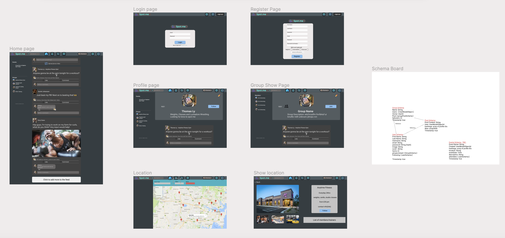
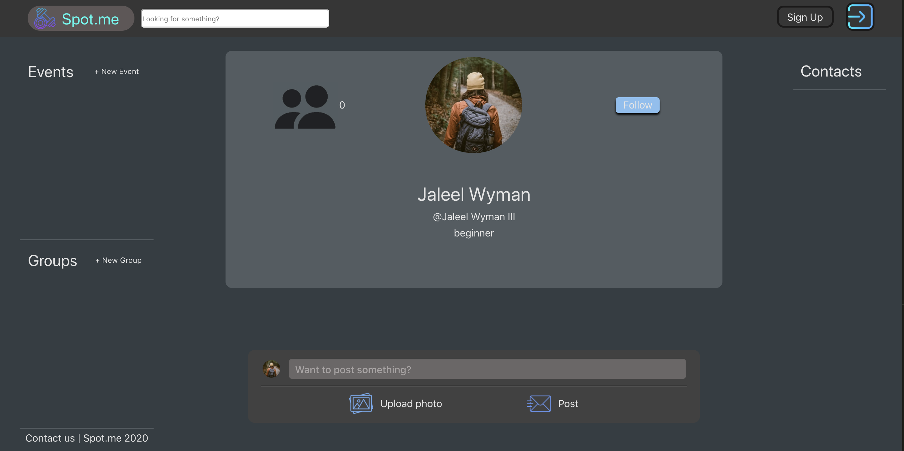
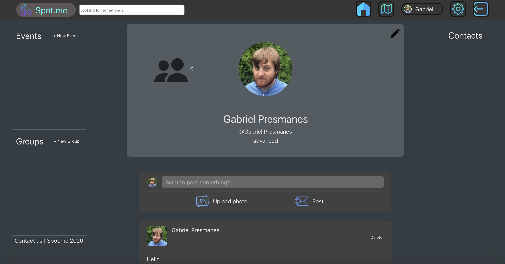
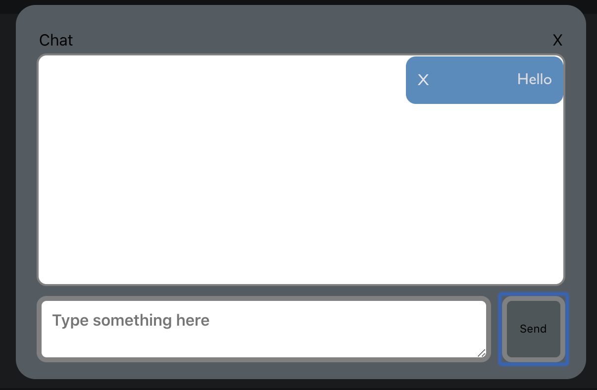
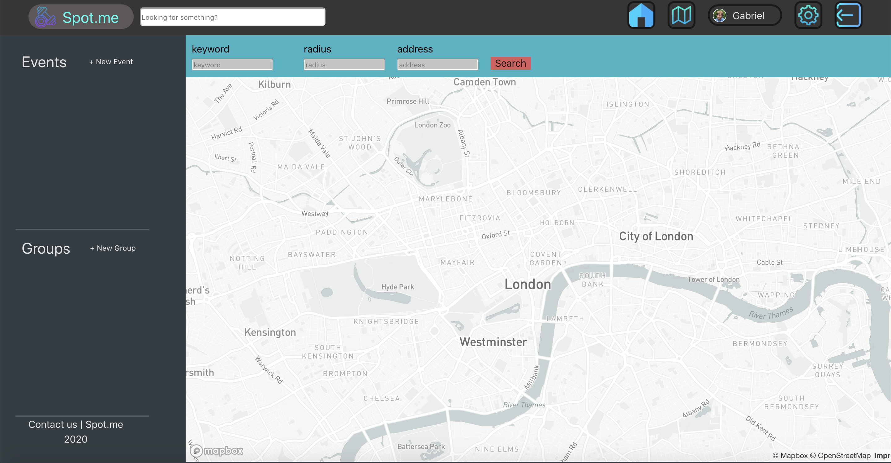
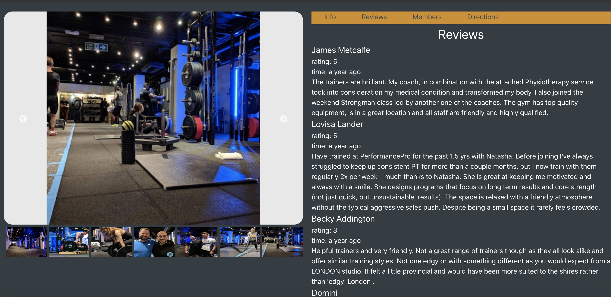

# sei-group-project-3
 
General Assembly Project 3: - Spot-me
 
## https://film-space-django.herokuapp.com/
 
## Goal:
Team project to design and create a MERN app using MongoDB, Mongoose and third-parties APIs
 
* Timeframe: 7 days
* Group members: 4
 
## Table of Contents
 
- [Overview](#overview)
- [Technologies](#technologies)
- [View](#view)
- [Wins](#wins)
- [Challenges](#challenges)
- [Lessons Learn](#lesson)
 
## Stand Up
 
We had a team standup every morning to update our progress, what we were planning to do next, as well as express any blockers we were experiencing. We also stayed in contact with each other throughout the day for advice.
 
## Overview
 
Spot-me is a full-stack social media app that uses third-party APIs (Mapbox and Google Places) to build a platform to encourage users to find fitness facilities in their area, follow users, create groups and posts.
 
Our app required data from Google Places, fitness facilities reviews and data, and Mapbox to produce a map of the zone, and where you can check the nearest facility.
 
This group project was a good experience to learn about teamwork, how to organize the task, and how to manage time. We divided the tasks among the members of the group; I worked styling the app using SASS and Bulma, I also worked in the frontend development, profile and newsfeed development.
 
## Technologies
 
### BackEnd
 
- MongoDB
- Mongoose
- JWT Auth
- Node.js
- Express
 
### FrontEnd
 
- React.js
- Bulma
- Mapbox
- Google API
- Axios
 
## Timeline
 
**Highlighted:** My contribution.
 
* Day 1: Completed wireframe design, and mapped out schemas.
 
* Day 2: Created frontend and backend for login, registration, **navbar**, and **profile pages**.
 
* Day 3: Completed Schema for users in the backend, location search, and **information page** in frontend.
 
* Day 4: Added seeds, posting, and **post-viewing functionality**.
 
* Day 5: Completed comment and likes to posts, **gym information pages**, group creation, and following.
 
* Day 6: Implimented Messaging, **home page**, search bar, **styling**.
 
* Day 7: Bug fixes and **styling**.
 
## Wireframe
 
Before we started, we created the overall wireframe for the pages using Figma. We wanted to give a clear outline of what the end product would be, the main reason was to save time when it came to the styling phase.
 

 
## View
 
### Profile page
 

 
### Post and likes
 

 
### Chat
 

 
### Map
 

 
### Info, images and reviews of a gym
 

 
## Featured code
 
### NewsFeeds
 
I implemented the Newsfeeds for the profile and home page, which the user can receive and see the information of posts, comments, and likes, also if the user posts or comment on something they can delete or edit the messages.
 
```
class NewsFeedsCard extends React.Component {
 
 render () {
   const { post, like, comment ,change, commentDelete,
   deletePost, i , setIndex, indexState, currentUser, value } = this.props
   // const post = this.props.post? this.props.post : ''
   return (
     <>
     <div className="wrap-center">
       <div className="feeds-container">
 
         <div className="feeds-header">
           <div className='feeds-user-info'>
             
             <h4 className="feeds-header-title">{post.owner.username}</h4>
           </div>
          
           <div
             className={currentUser.id === post.owner.id ?
               'display-block' : 'display-none'}
             onClick={()=>{
               deletePost(`${post._id}`)}}>
                 <p className='delete-text'>Delete </p>
             </div>
         </div>
 
         <div className="feeds-content">
           <h1>{post.content}</h1>
         </div>
         <div className="feeds-image">
           <figure>
             {post.image ?  : null}
           </figure>
         </div>
         <div
           onMouseEnter={()=>{
             setIndex(`${i}`)
           }} className="feeds-likes"
           onMouseLeave={()=>{
             setIndex(null)
           }}>
           
              
           <div className={`likes-hover ${i.toString() === indexState ? 'display-block' : 'display-none'}`}> 
             {post.likes? post.likes.map((like,i) => {
               return <p key={i}>{`${like.firstName}`}{`${like.lastName}`} liked this</p>
             }) : null}
           </div>
           <p><span>{post.likes.length > 0? post.likes.length : 0 }</span> likes</p>
         </div>
         <div className="feeds-buttons">
           <div className="field center-items">
             <div className="control center-items">
               <button className="feed-button" onClick={()=>{
                 like(`${post.owner.id}`,`${post._id}`)
               }}>
                 
                     Like
               </button>
               <button className="feed-button">
                 
                   Comment
               </button>
             </div>
           </div>
         </div>
            
         {post.comments ? post.comments.map(comment =>{
           return <div key={comment._id} className='post-comments-container'>
             <div className='post-comment-field'>
               
               <div className='commenters-comment'>
                 <p>{comment.user.username}</p>
                 <p>{comment.content}</p>
                 <div
                   className={currentUser.id === post.owner.id  ? 'display-block' : 'display-none' ||
                 currentUser.id === post.comment.user.id? 'display-block' : 'display-none' }
                   onClick={()=>commentDelete(`${post._id}`,`${post.owner._id}`,`${comment._id}`)}>
                   <p className='delete-text'>delete</p></div>
               </div>
             </div>
           </div>
         }) : null }
         <div className="feeds-comments">
           <figure className="picture">
             
           </figure>
           <div className="field">
             <form onSubmit={e=>{
               e.preventDefault(); comment(`${post.owner._id}` , `${post._id}`)
             }}>
               <textarea
                 className="textarea"
                 name="content"
                 placeholder="Write a comment..."
                 onChange={change}
                 value={value}/>
               <button> Send Comment </button>
             </form>
           </div>
         </div>
       </div>
     </div>
     </>
   )
 }
}
 
 
export default NewsFeedsCard
```
 
### Styling
 
I spent much of my time styling all the app. I struggled to fit everything to the correct scale, but thanks to the property position I managed to make everything fit. I'm proud of the style of the locations and Mapbox.
 
```
.locations {
 position: fixed;
 top: 60px;
 left: 300px;
}
 
.sidebar {
 background-color: #343D42;
 display: block;
 position: absolute;
 top: 60px;
 left: 0px;
 width: 220px;
 height: 100%;
 color: #E5E5E5;
}
 
.gym-search-container {
 background-color: #3DB2C2;
 
 .gym-search-form {
   display: flex;
 
   p {
     color: #000000;
   }
 }
 
 .keyword-field {
   margin: 10px 40px 10px 10px;
 }
 
 .radius-field {
   margin: 10px;
 }
  .address-field {
   margin: 10px;
 }
 
 .form-input {
   background-color: #C4C4C4;
 }
 
 button {
   margin: 35px 0px 0px 10px;
   background-color:#DA5C5C;
 }
 
 button:hover {
   background-color:#6A6767;
 }
}
 
.gym-modal-info {
 height: 150px;
 width: 600px;
 background-color: white;
 
 .close {
   display: flex;
   justify-content: flex-end;
   margin-right: 10px;
   color: grey;
 }
 
 h1 {
   font-weight: 700;
   margin-left: 10px;
 }
 
 p {
   margin-left: 10px;
 }
}
 
.searchBarNav {
 width: 300px;
 height: 30px;
 margin-top: 15px;
 border-radius: 5px;
 
}
 
.inline-link {
 width:100%;
 display: flex;
 flex-wrap: nowrap;
  p {
   display: inline-block;
  
   margin-left: 10px;
   margin-bottom: 15px;
  
 }
 margin: 0;
}
 
.no-padd {
 padding: 0;
}
 
.item-styling {
 display: block;
}
 
.centered {
 text-align: center;
 margin-bottom: 15px;
 margin-left: 35%;
}
 
.searchbar-profile-picture {
 transform: scale(1.5);
 border-radius: 50%;
 display: inline-block;
 margin-bottom: 2px;
 margin-top: -2px;
 margin-right: 5px;
}
 
.field-searchbar-item {
 width:100%
}
```
 
## Wins
 
Making the NewsFeeds was a big win for me, I managed to retrieve the data from the backend to render it correctly in the profile page. Styling the app and made it similar to the wireframe we drew is one of my biggest wins in this project.
 
## Challenges
 
One of the challenges we faced was communicatting; so many times I or other people of the group changed something but didn't say it, resulting in setbacks for the deadlines. Another challenge was to make backend relationships and populate them. We fixed the backend problems but it cost us a lot of time.
 
## Bugs
 
* Friends sidebar does not show names, there are limitations with the architecture of the user schema.
 
* Message deleting only deletes for the user and not the recipient.
 
## Lesson
 
A better understanding of how the BackEnd and FrontEnd work together and how works the props and whether to put the state in the parent component saves a lot of time. Work on team communication, we often committed some mistakes and we didn't talk about how our work was progressing.
